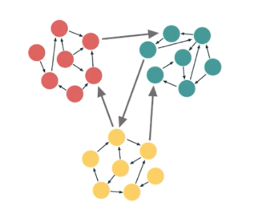

# Feature-Sliced Design (FSD)
### [Architectural methodology](https://feature-sliced.design/)

The main purpose of this methodology is to make the project more understandable and structured in the face of ever-changing business requirements.
The main idea of Feature-Sliced Design is to facilitate and reduce the cost of developing complex and developing projects, based on combining research results, discussing the experience of various kinds of a wide range of developers.

The project consists of layers, each layer is made up of slices and each slice is made up of segments.

The layers are standardized across all projects and vertically arranged. Modules on one layer can only interact with modules from the layers strictly below. There are currently seven of them (bottom to top):

- **shared** — reusable functionality, detached from the specifics of the project/business.(e.g. UIKit, libs, API)
- **entities** — business entities.(e.g., User, Product, Order)
- **features** — user interactions, actions that bring business value to the user.(e.g. SendComment, AddToCart, UsersSearch)
- **widgets** — compositional layer to combine entities and features into meaningful blocks.(e.g. IssuesList, UserProfile)
- **pages** — compositional layer to construct full pages from entities, features and widgets.
- **processes** — complex inter-page scenarios. (e.g., authentication)
- **app** — app-wide settings, styles and providers.

Then there are **slices**, which partition the code by business domain. This makes your codebase easy to navigate by keeping logically related modules close together. Slices cannot use other slices on the same layer, and that helps with high cohesion and low coupling.
Each slice, in turn, consists of **segments**. These are tiny modules that are meant to help with separating code within a slice by its technical purpose. The most common segments are ui, model (store, actions), api and lib (utils/hooks), but you can omit some or add more, as you see fit.

##Advantages

- **Uniformity.**
The code is organized by scope of influence (layers), by domain (slices), and by technical purpose (segments).
This creates a standardized architecture that is easier to comprehend for newcomers.

- **Controlled reuse of logic.**
Each architectural component has its purpose and predictable dependencies.
This keeps a balance between following the DRY principle and adaptation possibilities.

- **Stability in face of changes and refactoring.**
A module on a particular layer cannot use other modules on the same layer, or the layers above.
This enables isolated modifications without unforeseen consequences.

- **Orientation to business and users needs.**
App splitting by business domains help to deeper understand, structure and discovery project features.

###Interaction between various web application components

###Public API 
index.ts as public API
